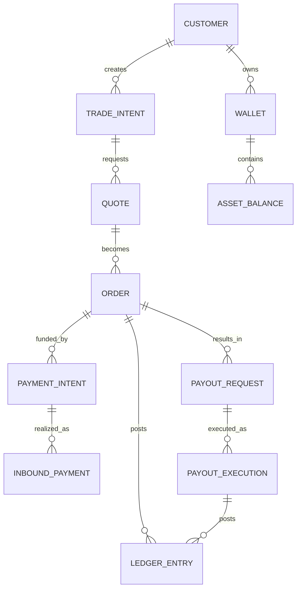
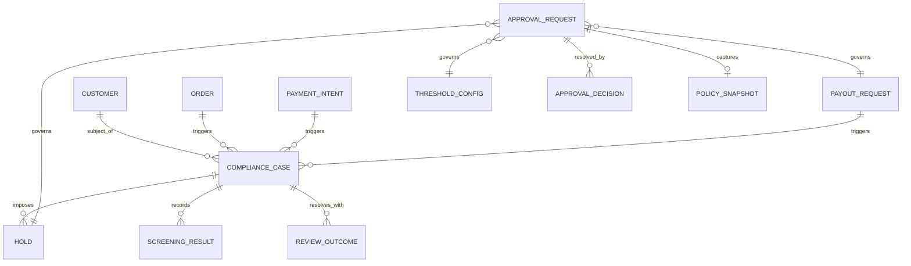
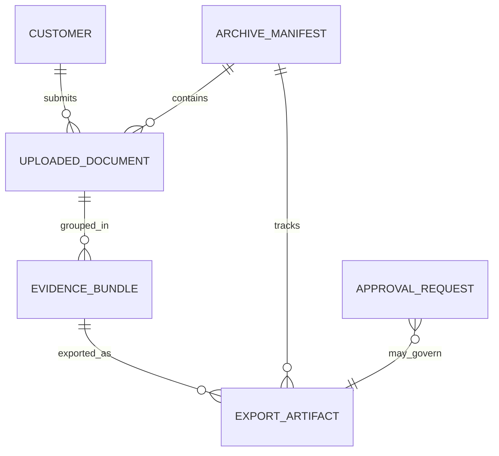
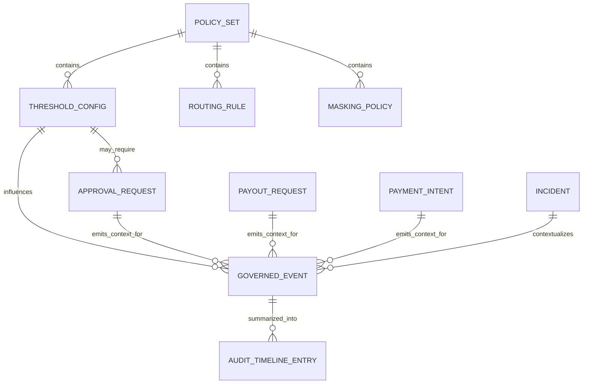

# Visual ERD & Canonical Relationship Map — TheBlack.Trade

## Document metadata

- Status: active
- Role: Derived reference
- Owner: Data Architecture
- Version: v1.0
- Last reviewed: 2026-10-03
- Change log: Metadata normalized on 2026-10-03.
- Supersedes: none explicitly declared
- Depends on:
  - `data-model-canonical-entities-spec.md`
  - `canonical-erd-and-field-dictionary-spec.md`
- Related documents:
  - `visual-erd-and-enum-state-dictionary.md`
  - `data-migration-and-backfill-strategy-spec.md`

## 1. Purpose

This document defines a visual and canonical relationship map for the core entities of TheBlack.Trade. It is intended to complement canonical entity, API boundary, workflow, event and governance documents with a single architecture-level view of the most important business objects, ownership boundaries and relationship patterns across the platform.

The goal is not to replace implementation-level database diagrams for each service. The goal is to establish a shared cross-domain understanding of which entities exist, which domain owns them, how they relate, and where workflow/governance attachments connect to core business records.

## 2. Goals

The map must:

- identify the main canonical entities and their owning domains;
- show primary one-to-one, one-to-many and many-to-many relationship patterns;
- distinguish canonical records from workflow, event and derived objects;
- make cross-domain reference boundaries explicit;
- help product, engineering, data, QA, compliance, finance and operations reason about platform structure;
- support future service decomposition, schema review, API review and analytics design.

## 3. Non-goals

This document does not define:

- every field of every table or document;
- physical database layout, indexes or storage-engine choices;
- every provider-specific integration object;
- a definitive per-service implementation ERD.

## 4. Reading rules

### Entity classes used in this map

| Class | Meaning |
|---|---|
| Core entity | Canonical business object with primary lifecycle |
| Workflow entity | Governance/review/incident object attached to business flows |
| Supporting entity | Important canonical supporting record |
| Artifact entity | Documents, exports, evidence or archive packages |
| Event entity | Canonical event family/logical event object |
| Derived view | Aggregated read model or reporting projection |

### Relationship guidance

- solid relationships indicate canonical references or ownership-linked associations;
- workflow attachments represent process linkage, not lifecycle ownership of the core entity;
- event entities record what happened and normally do not own the business object they reference.

## 5. Domain ownership summary

| Domain | Primary canonical entities |
|---|---|
| Customer/identity | `customer`, `customer_profile`, `contact_point`, `kyc_case_link` |
| Order/trade | `quote`, `order`, `trade_intent`, `pricing_lock` |
| Payments/inbound funds | `payment_intent`, `inbound_payment`, `settlement_reference` |
| Payouts/outbound funds | `payout_request`, `payout_execution`, `destination_authorization` |
| Wallet/ledger | `wallet`, `asset_balance`, `ledger_entry`, `asset_transfer` |
| Compliance/risk | `compliance_case`, `hold`, `risk_alert`, `screening_result`, `review_outcome` |
| Governance/approval | `approval_request`, `approval_decision`, `policy_snapshot` |
| Documents/evidence | `uploaded_document`, `evidence_bundle`, `archive_manifest`, `export_artifact` |
| Notifications | `notification_request`, `notification_delivery_attempt`, `notification_template` |
| Incidents/operations | `incident`, `incident_action`, `postmortem_reference` |
| Config/policy | `threshold_config`, `policy_set`, `routing_rule`, `masking_policy` |
| Observability/audit | `governed_event`, `audit_timeline_entry` |

## 6. Canonical cross-domain principles

1. Each canonical entity has a single primary owning domain.
2. Cross-domain relationships are normally references, not co-ownership.
3. Workflow entities attach to core business entities but do not replace them.
4. Derived read models may denormalize across domains but are not canonical.
5. Event and audit records reference business objects through stable IDs and correlation links.

## 7. Top-level relationship map

```mermaid
erDiagram
    CUSTOMER ||--o| CUSTOMER_PROFILE : has
    CUSTOMER ||--o{ CONTACT_POINT : uses
    CUSTOMER ||--o{ KYC_CASE_LINK : linked_to
    CUSTOMER ||--o{ ORDER : places
    CUSTOMER ||--o{ PAYMENT_INTENT : initiates
    CUSTOMER ||--o{ PAYOUT_REQUEST : requests
    CUSTOMER ||--o{ WALLET : owns
    CUSTOMER ||--o{ UPLOADED_DOCUMENT : submits

    QUOTE ||--o{ ORDER : converts_to
    TRADE_INTENT ||--o{ QUOTE : requests
    PRICING_LOCK ||--o{ ORDER : constrains

    ORDER ||--o{ PAYMENT_INTENT : funded_by
    ORDER ||--o{ PAYOUT_REQUEST : settles_via
    ORDER ||--o{ LEDGER_ENTRY : posts
    ORDER ||--o{ NOTIFICATION_REQUEST : notifies

    PAYMENT_INTENT ||--o{ INBOUND_PAYMENT : realizes
    INBOUND_PAYMENT ||--o{ SETTLEMENT_REFERENCE : settles_with
    INBOUND_PAYMENT ||--o{ LEDGER_ENTRY : posts

    PAYOUT_REQUEST ||--o| DESTINATION_AUTHORIZATION : uses
    PAYOUT_REQUEST ||--o{ PAYOUT_EXECUTION : executes_as
    PAYOUT_EXECUTION ||--o{ SETTLEMENT_REFERENCE : settles_with
    PAYOUT_EXECUTION ||--o{ LEDGER_ENTRY : posts

    WALLET ||--o{ ASSET_BALANCE : contains
    WALLET ||--o{ ASSET_TRANSFER : sends_or_receives
    ASSET_TRANSFER ||--o{ LEDGER_ENTRY : posts

    CUSTOMER ||--o{ COMPLIANCE_CASE : subject_of
    ORDER ||--o{ COMPLIANCE_CASE : may_trigger
    PAYMENT_INTENT ||--o{ COMPLIANCE_CASE : may_trigger
    PAYOUT_REQUEST ||--o{ COMPLIANCE_CASE : may_trigger
    COMPLIANCE_CASE ||--o{ HOLD : imposes
    COMPLIANCE_CASE ||--o{ SCREENING_RESULT : records
    COMPLIANCE_CASE ||--o{ REVIEW_OUTCOME : resolves_with
    RISK_ALERT ||--o{ COMPLIANCE_CASE : escalates_to

    APPROVAL_REQUEST ||--o{ APPROVAL_DECISION : resolved_by
    APPROVAL_REQUEST ||--o| POLICY_SNAPSHOT : evaluated_against
    APPROVAL_REQUEST }o--|| ORDER : governs
    APPROVAL_REQUEST }o--|| PAYMENT_INTENT : governs
    APPROVAL_REQUEST }o--|| PAYOUT_REQUEST : governs
    APPROVAL_REQUEST }o--|| HOLD : governs
    APPROVAL_REQUEST }o--|| THRESHOLD_CONFIG : governs
    APPROVAL_REQUEST }o--|| EXPORT_ARTIFACT : governs

    INCIDENT ||--o{ INCIDENT_ACTION : includes
    INCIDENT ||--o{ APPROVAL_REQUEST : escalates
    INCIDENT ||--o{ PAYOUT_REQUEST : affects
    INCIDENT ||--o{ THRESHOLD_CONFIG : may_modify
    INCIDENT ||--o{ GOVERNED_EVENT : contextualizes

    UPLOADED_DOCUMENT ||--o{ EVIDENCE_BUNDLE : included_in
    EVIDENCE_BUNDLE ||--o{ EXPORT_ARTIFACT : packaged_as
    ARCHIVE_MANIFEST ||--o{ EXPORT_ARTIFACT : tracks
    ARCHIVE_MANIFEST ||--o{ UPLOADED_DOCUMENT : archives

    NOTIFICATION_TEMPLATE ||--o{ NOTIFICATION_REQUEST : renders
    NOTIFICATION_REQUEST ||--o{ NOTIFICATION_DELIVERY_ATTEMPT : delivers_as

    POLICY_SET ||--o{ THRESHOLD_CONFIG : contains
    POLICY_SET ||--o{ ROUTING_RULE : contains
    POLICY_SET ||--o{ MASKING_POLICY : contains

    GOVERNED_EVENT }o--|| APPROVAL_REQUEST : references
    GOVERNED_EVENT }o--|| PAYOUT_REQUEST : references
    GOVERNED_EVENT }o--|| PAYMENT_INTENT : references
    GOVERNED_EVENT }o--|| THRESHOLD_CONFIG : references
    GOVERNED_EVENT }o--|| INCIDENT : references
    AUDIT_TIMELINE_ENTRY }o--|| GOVERNED_EVENT : derived_from
```

## 8. Core commercial flow slice

The commercial flow starts with customer intent and pricing, moves through order creation and funding, and may end in payout execution, wallet movement or both depending on product flow.

### Interpretation notes

- `trade_intent` and `quote` are pre-commit objects;
- `order` is the core commercial commitment object;
- `payment_intent` and `inbound_payment` cover inbound funding path;
- `payout_request` and `payout_execution` cover outbound value movement;
- `ledger_entry` is supporting but critical for financial traceability.

## 9. Compliance and governance attachment slice

Compliance and governance objects attach to business entities rather than replacing them.

### Interpretation notes

- a `compliance_case` may be opened because of customer, order, payment or payout context;
- a `hold` is normally attached through compliance/risk or operational context;
- `approval_request` is governance workflow state, not the business action itself;
- `policy_snapshot` preserves decision context used for approval.

## 10. Documents, evidence and archive slice

Sensitive artifacts have their own lifecycle and references.

### Interpretation notes

- `uploaded_document` remains canonical evidence artifact input;
- `evidence_bundle` groups documents for operational/compliance use;
- `export_artifact` and archive retrieval are governed outputs, not the original evidence source;
- approval may govern access/export operations at higher sensitivity levels.

## 11. Policy, config and observability slice

Thresholds and policies are governed resources whose effects should be reconstructable through events.

### Interpretation notes

- `policy_set` is a grouped governance/configuration container;
- `threshold_config`, `routing_rule` and `masking_policy` are governed config subtypes;
- `governed_event` is not a business owner, but a canonical trace record for decisions and outcomes.

## 12. Canonical entity relationship table

| Entity | Class | Owning domain | Key upstream relationships | Key downstream relationships |
|---|---|---|---|---|
| `customer` | Core entity | Customer/identity | none | profile, contact points, orders, wallets, docs, cases |
| `order` | Core entity | Order/trade | customer, quote, pricing lock | payment intents, payouts, ledger entries, notifications, cases |
| `payment_intent` | Core entity | Payments | customer, order | inbound payments, cases, approvals, events |
| `inbound_payment` | Core entity | Payments | payment intent | settlement refs, ledger entries |
| `payout_request` | Core entity | Payouts | customer, order, destination auth | payout executions, cases, approvals, events |
| `payout_execution` | Supporting entity | Payouts | payout request | settlement refs, ledger entries |
| `wallet` | Core entity | Wallet/ledger | customer | balances, transfers |
| `ledger_entry` | Supporting entity | Wallet/ledger | order/payment/payout/transfer | financial trace and reporting |
| `compliance_case` | Workflow entity | Compliance/risk | customer/order/payment/payout/risk alert | holds, screening, review outcome |
| `hold` | Workflow entity | Compliance/risk | compliance case | governs action blocking and approvals |
| `approval_request` | Workflow entity | Governance/approval | governed subject + policy decision | approval decisions, possible execution |
| `policy_snapshot` | Supporting entity | Governance/approval | approval request | preserves approval decision context |
| `uploaded_document` | Artifact entity | Documents/evidence | customer or business flow context | bundles, archive manifests |
| `export_artifact` | Artifact entity | Documents/evidence | bundles, archive jobs | governed access/download |
| `incident` | Workflow entity | Incidents/operations | none | incident actions, governance escalations |
| `threshold_config` | Core entity | Config/policy | policy set | policy evaluation behavior, approvals, events |
| `governed_event` | Event entity | Observability/audit | many core/workflow entities | timelines, dashboards, audit chains |

## 13. Relationship patterns by type

### Ownership relationships

Examples:

- `customer` -> `contact_point`
- `wallet` -> `asset_balance`
- `approval_request` -> `approval_decision`
- `incident` -> `incident_action`

### Referential attachments

Examples:

- `approval_request` -> `payout_request`
- `compliance_case` -> `order`
- `governed_event` -> `threshold_config`
- `notification_request` -> `order`

### Aggregation/packaging relationships

Examples:

- `uploaded_document` -> `evidence_bundle`
- `evidence_bundle` -> `export_artifact`
- `archive_manifest` -> archived document set

## 14. Canonical boundary notes

### Customer boundary

`customer` is the subject anchor for many flows but does not own downstream financial objects directly. Orders, payments, payouts and compliance cases reference the customer while retaining their own owning domains.

### Order boundary

`order` is the central commercial object. It may reference quote and pricing context, but funding, payout and ledger consequences belong to their respective downstream domains.

### Payment vs payout boundary

Inbound and outbound money movement should remain distinct canonical boundaries even if they share reporting or UI surfaces.

### Governance boundary

`approval_request`, `approval_decision` and `policy_snapshot` belong to governance. They govern actions on other entities but do not become their state owner.

### Event boundary

`governed_event` is canonical for traceability, not for domain business truth.

## 15. Many-to-many caution zones

The following areas require careful modeling discipline:

| Area | Why it is tricky |
|---|---|
| `customer` <-> `wallet` | One customer may have multiple wallets; shared/organizational ownership patterns may complicate assumptions |
| `approval_request` <-> governed subjects | One workflow model may govern multiple entity types; polymorphic references must stay explicit |
| `uploaded_document` <-> business context | One document may support multiple cases/orders/reviews; linking model must avoid ambiguity |
| `governed_event` <-> subjects | Events often reference heterogeneous subjects and workflows |
| `notification_request` <-> subject context | Notifications may be driven by different business anchors |

## 16. Derived views and reporting projections

These are not canonical entities, but important architectural objects:

- customer 360 admin view;
- payout operations queue view;
- approval inbox view;
- governed-action dashboard views;
- audit timeline view.

### Rule

Derived views may join multiple canonical domains, but should expose canonical IDs and should not become hidden write owners.

## 17. Suggested visual legend for future diagram work

When creating richer diagrams later, use:

- blue = core commercial entities;
- red = compliance/governance entities;
- green = documents/artifacts;
- purple = config/policy entities;
- gray = events/audit/derived views.

This file remains text-and-Mermaid oriented so it can live in docs and version control without specialized tooling.

## 18. Recommended follow-up decomposition

This architecture-level map should later be complemented by narrower diagrams:

- commercial flow ERD;
- payments/payouts money movement ERD;
- compliance and holds workflow map;
- approval/governance workflow ERD;
- documents/archive relationship map;
- policy/config relationship map;
- event lineage and correlation map.

## 19. QA and review expectations

Need to validate:

- every entity listed here maps to canonical entity and API docs;
- ownership boundaries are consistent with command/resource ownership;
- workflows are shown as attachments rather than hidden state owners;
- derived views are not confused with canonical records;
- polymorphic references and many-to-many zones are called out explicitly.

## 20. Anti-patterns to avoid

- treating admin screens as proof of canonical ownership;
- letting workflow objects replace business objects in mental model;
- overloading one entity to cover payment, payout and ledger semantics at once;
- hiding cross-domain references inside free-form JSON blobs without contract;
- treating event/audit entities as the canonical source of domain truth.

## 21. Related documents

Use together with:

- `data-model-canonical-entities-spec.md`
- `api-resource-boundaries-and-contract-spec.md`
- `enum-and-state-dictionary-spec.md`
- `governed-event-taxonomy-and-schema-registry-spec.md`
- `approval-workflow-schema.md`
- `data-retention-and-archival-spec.md`
- `field-level-sensitivity-and-masking-matrix.md`
- `admin-console-ia-and-workspace-spec.md`