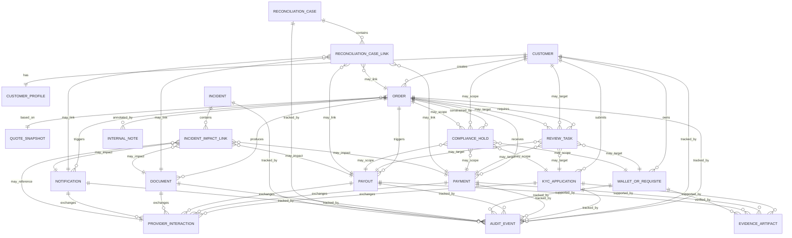

## Document metadata

- Status: active
- Role: Derived reference
- Owner: Data Architecture + Product
- Version: v1.0
- Last reviewed: 2026-10-03
- Change log: Metadata normalized on 2026-10-03.
- Supersedes: none explicitly declared
- Depends on:
  - `enum-and-state-dictionary-spec.md`
  - `canonical-erd-and-field-dictionary-spec.md`
- Related documents:
  - `visual-erd-and-canonical-relationship-map.md`
  - `theblack-trade-order-state-machine-spec.md`

# Visual ERD & Enum State Dictionary — TheBlack.Trade

## 1. Назначение документа

Этот документ дополняет canonical entity model и field dictionary двумя прикладными артефактами:

1. визуальным ERD-представлением ключевых сущностей и связей;
2. enum/state dictionary для основных lifecycle, review, delivery, hold, incident и reconciliation состояний.

Документ нужен как bridge между domain model, schema design, backend services, Directus mapping, admin console, analytics и QA.

## 2. Цели документа

Документ должен обеспечивать:

- единое визуальное представление core business model;
- согласованное понимание cardinality и ownership of state;
- единый словарь canonical enum/state values;
- базу для API contracts, admin UI logic, analytics mapping и test scenarios;
- снижение риска дублирующихся или конфликтующих статусных моделей.

## 3. Scope

Документ покрывает:

- visual ERD for canonical entities;
- scoped relationship rules;
- enum/state dictionaries for major entities;
- transition semantics at the dictionary level;
- reason code families and projection notes.

## 4. ERD modeling principles

1. **Business lifecycle status belongs to the entity that owns the lifecycle.**
2. **Shared supporting records should reference business entities, not replace them.**
3. **Many-to-many relations should be explicit when they carry case meaning.**
4. **Projection labels are not canonical states.**
5. **Cross-entity traceability is mandatory for payments, payouts, KYC and reconciliation.**

## 5. Visual ERD

## 6. Relationship notes

### Direct ownership relationships

- `Customer -> Order`, `Customer -> KYCApplication`, `Customer -> WalletOrRequisite` are primary ownership links.
- `Order -> Payment` and `Order -> Payout` are core financial leg relations.
- `Order -> Document`, `Order -> Notification`, `Order -> ReviewTask`, `Order -> ComplianceHold` are workflow/supporting relations.

### Scoped/shared relations

- `ReviewTask`, `ComplianceHold`, `InternalNote`, `AuditEvent`, `EvidenceArtifact`, `ProviderInteraction` may target different entity types through scoped linking.
- `ReconciliationCase` and `Incident` should use explicit join/link tables because they often relate to multiple impacted records.

## 7. Canonical status ownership

| Entity | Canonical status field | Notes |
|---|---|---|
| Customer | `account_status` | High-level account eligibility, not transactional lifecycle |
| KYCApplication | `status` | Owns verification lifecycle |
| Order | `status` | Owns main trade lifecycle |
| Payment | `status` | Owns inbound payment lifecycle |
| Payout | `status` | Owns outbound transfer lifecycle |
| WalletOrRequisite | `status` | Owns verification lifecycle for destination/source details |
| Document | `status` | Owns generation and issue lifecycle |
| Notification | `status` | Owns delivery lifecycle |
| ReviewTask | `status` | Owns queue/review task lifecycle |
| ComplianceHold | `status` | Owns hold lifecycle |
| ReconciliationCase | `status` | Owns discrepancy case lifecycle |
| Incident | `status` | Owns incident lifecycle |

## 8. Customer account status enum

### Field

`customer.account_status`

### Values

| Value | Meaning |
|---|---|
| `draft` | Customer record created but not ready for operational use |
| `active` | Customer can use normal platform flows subject to other checks |
| `restricted` | Some actions limited due to risk/compliance/operations constraints |
| `suspended` | Customer activity paused pending review or decision |
| `closed` | Customer relationship closed or no longer operationally active |
| `archived` | Historical record retained but not active |

### Notes

- `restricted` and `suspended` are account-level conditions and do not replace `ComplianceHold` records.
- Detailed reasons should live in holds/restrictions, not only in the account status.

## 9. KYC application status enum

### Field

`kyc_application.status`

### Values

| Value | Meaning |
|---|---|
| `draft` | Case created but submission not complete |
| `submitted` | Evidence/application submitted and awaiting review/provider response |
| `in_review` | Under manual or provider-assisted review |
| `needs_remediation` | Additional documents or corrections required |
| `approved` | Verification accepted |
| `rejected` | Verification denied |
| `expired` | Case no longer valid and must be resubmitted |
| `archived` | Historical case archived |

### Projection notes

Customer-facing copy may collapse `submitted` and `in_review` into a simpler “verification in progress” label.

## 10. Order status enum

### Field

`order.status`

### Values

| Value | Meaning |
|---|---|
| `draft` | Flow started but order not fully created/confirmed |
| `created` | Canonical order created and waiting for prerequisites |
| `awaiting_customer_action` | Waiting for customer input, payment, wallet data or remediation |
| `awaiting_review` | Waiting for operations/compliance/manual review |
| `on_hold` | Progress intentionally paused by hold or restriction |
| `processing` | Required checks passed and execution in progress |
| `partially_completed` | Some but not all expected business legs completed |
| `completed` | Order fulfilled successfully |
| `failed` | Order cannot complete due to internal/provider/financial failure |
| `rejected` | Order stopped by business/compliance/operations decision |
| `canceled` | Order canceled by customer or system before completion |
| `expired` | Order validity window elapsed |
| `archived` | Historical order archived |

### Notes

- `awaiting_customer_action` is preferred over proliferating micro-statuses for every possible user input gap.
- `failed`, `rejected` and `canceled` should remain distinct because they imply different analytics and operational meaning.

## 11. Payment status enum

### Field

`payment.status`

### Values

| Value | Meaning |
|---|---|
| `expected` | Payment leg anticipated but not yet evidenced/received |
| `submitted` | Customer evidence or payment notice received |
| `pending_confirmation` | Awaiting provider confirmation or internal validation |
| `in_review` | Under manual review |
| `needs_more_info` | Additional proof or correction required |
| `confirmed` | Payment validated successfully |
| `mismatch` | Received/submitted data conflicts with expectation |
| `rejected` | Payment evidence or attempt rejected |
| `failed` | Payment leg failed technically or operationally |
| `canceled` | Payment leg intentionally voided or no longer pursued |
| `archived` | Historical payment archived |

### Notes

- `mismatch` should usually lead to or link with a `ReconciliationCase`, but should remain distinct as a payment state.
- `confirmed` means the payment leg is accepted, not necessarily that the whole order is completed.

## 12. Payout status enum

### Field

`payout.status`

### Values

| Value | Meaning |
|---|---|
| `planned` | Payout expected but not yet ready for release |
| `awaiting_release` | Preconditions met and waiting for manual/automated release |
| `on_hold` | Release blocked by hold, risk or unresolved dependency |
| `releasing` | Release/execution initiated |
| `in_transit` | Provider execution started, final completion pending |
| `completed` | Outbound leg completed successfully |
| `failed` | Payout could not complete |
| `returned` | Payout returned/reversed or sent back to investigation |
| `canceled` | Payout intentionally voided before execution |
| `archived` | Historical payout archived |

### Notes

- `awaiting_release` and `on_hold` must stay distinct for queueing and SLA purposes.
- `returned` captures a different operational path than `failed` and often implies finance follow-up.

## 13. Wallet or requisite status enum

### Field

`wallet_or_requisite.status`

### Values

| Value | Meaning |
|---|---|
| `draft` | Saved but not yet ready for verification |
| `submitted` | Provided for review/validation |
| `in_review` | Under manual or automated validation |
| `verified` | Approved for allowed use |
| `rejected` | Explicitly denied |
| `locked` | Temporarily blocked from use |
| `superseded` | Replaced by a newer verified detail set |
| `archived` | Historical record archived |

## 14. Document status enum

### Field

`document.status`

### Values

| Value | Meaning |
|---|---|
| `pending_generation` | Document expected but not yet generated |
| `generated` | Produced successfully |
| `issued` | Officially attached/released in business flow |
| `delivery_pending` | Waiting for send/access step |
| `delivered` | Delivery/access confirmed |
| `delivery_failed` | Delivery failed |
| `superseded` | Replaced by reissue/newer version |
| `canceled` | Generation or issue intentionally stopped |
| `archived` | Historical document archived |

### Notes

Some implementations may merge `generated` and `issued`, but if the business process distinguishes draft generation from formal issue, both states should remain available.

## 15. Notification status enum

### Field

`notification.status`

### Values

| Value | Meaning |
|---|---|
| `queued` | Awaiting dispatch |
| `sending` | Send attempt in progress |
| `sent` | Provider accepted/send completed |
| `delivered` | Downstream delivery confirmed where available |
| `suppressed` | Intentionally prevented due to policy/incident/rules |
| `failed` | Send/delivery failed |
| `canceled` | Notification intentionally canceled before send |
| `archived` | Historical notification archived |

### Notes

- `sent` and `delivered` must remain distinct because many channels do not guarantee end delivery.
- `suppressed` is operationally important during incidents and policy-based holds.

## 16. Review task status enum

### Field

`review_task.status`

### Values

| Value | Meaning |
|---|---|
| `open` | Entered queue and awaiting active handling |
| `assigned` | Explicitly assigned to reviewer |
| `in_progress` | Reviewer actively processing |
| `waiting_dependency` | Task blocked by external input or linked case outcome |
| `escalated` | Escalated to specialist/supervisor |
| `resolved` | Decision or required action completed |
| `canceled` | Task no longer needed |
| `archived` | Historical task archived |

### Notes

Task resolution should also store structured outcome codes, not only rely on `resolved`.

## 17. Compliance hold status enum

### Field

`compliance_hold.status`

### Values

| Value | Meaning |
|---|---|
| `open` | Hold active and blocking/restricting progress |
| `under_review` | Hold being investigated for decision |
| `partially_released` | Some restrictions lifted, others remain |
| `released` | Hold removed and no longer active |
| `expired` | Hold ceased due to timeout/policy condition |
| `archived` | Historical hold archived |

### Hold type family

Recommended `hold_type` family:

- `compliance`
- `risk`
- `finance`
- `provider_uncertainty`
- `incident_protection`
- `document_issue`

## 18. Reconciliation case status enum

### Field

`reconciliation_case.status`

### Values

| Value | Meaning |
|---|---|
| `open` | Discrepancy discovered and case created |
| `investigating` | Under finance/operations review |
| `waiting_external` | Awaiting provider/bank/exchange/external input |
| `waiting_internal` | Awaiting linked internal review or data fix |
| `resolved` | Reconciled and closed successfully |
| `reopened` | Previously closed case reopened |
| `canceled` | Case voided because mismatch was invalid/duplicate |
| `archived` | Historical case archived |

### Case type family

Recommended `case_type` family:

- `amount_mismatch`
- `missing_reference`
- `duplicate_record`
- `unmatched_payment`
- `unmatched_payout`
- `provider_conflict`
- `ledger_gap`
- `documentary_gap`

## 19. Incident status enum

### Field

`incident.status`

### Values

| Value | Meaning |
|---|---|
| `detected` | Incident identified but triage still forming |
| `investigating` | Cause and scope under active investigation |
| `mitigating` | Workaround/fix in progress |
| `monitoring` | Primary mitigation applied, watching for stability |
| `resolved` | Incident ended and service restored |
| `postmortem_pending` | Operational resolution done, follow-up still required |
| `closed` | Incident and review fully closed |
| `archived` | Historical incident archived |

### Severity family

Recommended `severity` family:

- `sev_1`
- `sev_2`
- `sev_3`
- `sev_4`

## 20. Audit event action family

### Field

`audit_event.action_type`

### Recommended action families

| Family | Examples |
|---|---|
| Authentication/session | login, logout, password_reset, session_invalidated |
| Entity lifecycle | created, updated, archived, restored |
| Review/decision | approved, rejected, requested_more_info, escalated |
| Hold/restriction | hold_opened, hold_released, restriction_changed |
| Financial action | payout_released, payout_canceled, discrepancy_resolved |
| Communication | notification_sent, notification_suppressed, document_issued |
| Administration | permission_changed, config_changed, feature_toggled |

### Notes

`AuditEvent` is append-only history and should not be modeled as a mutable state machine.

## 21. Reason code families

Canonical statuses should be complemented by structured reason-code families.

### Recommended families

- `rejection_reason_code`
- `review_outcome_code`
- `hold_reason_code`
- `suppression_reason_code`
- `failure_reason_code`
- `resolution_code`
- `remediation_reason_code`

### Principle

Statuses should answer “what state is it in,” while reason codes answer “why did it get there.”

## 22. Customer-facing projection rules

Customer-facing labels should be derived from canonical machine states, not stored as independent conflicting states.

### Examples

| Canonical state | Possible customer-facing projection |
|---|---|
| `kyc_application.submitted` / `in_review` | Verification in progress |
| `order.awaiting_customer_action` | Action required |
| `order.awaiting_review` / `on_hold` | Under review |
| `payout.awaiting_release` / `releasing` / `in_transit` | Transfer in progress |
| `notification.suppressed` | Usually no direct customer-facing projection |

## 23. Anti-patterns to avoid

- storing both canonical and customer-facing statuses as competing source-of-truth fields;
- duplicating `status` semantics on parent and child entities without clear ownership;
- encoding hold or review outcomes only in free-text notes;
- over-fragmenting workflows into dozens of micro-statuses that should be handled by reason codes or projections;
- collapsing `failed`, `rejected`, `canceled` and `expired` into one catch-all terminal state.

## 24. QA and implementation checks

### Need to validate

- each lifecycle enum has a single owning entity;
- child states do not silently overwrite parent lifecycle meaning;
- admin queues and dashboards map to canonical states consistently;
- analytics KPIs use the canonical status dictionary rather than ad hoc labels;
- API contracts expose state and reason codes predictably;
- archived records preserve prior terminal state semantics.

## 25. Recommended follow-up artifacts

На базе этого документа рекомендуется создать:

- rendered ERD diagram for Figma/Confluence;
- enum catalog with exact code values and display labels;
- state transition matrix per entity;
- reason-code registry;
- API/status mapping sheet;
- analytics event-to-status mapping table.

## 26. Related documents

Использовать вместе с:

- `data-model-canonical-entities-spec.md`
- `canonical-erd-and-field-dictionary-spec.md`
- `theblack-trade-order-state-machine-spec.md`
- `transaction-status-state-machine-spec.md`
- `field-level-sensitivity-and-masking-matrix.md`
- `analytics-and-reporting-spec.md`
- `observability-and-audit-spec.md`
- `reconciliation-and-ledger-spec.md`