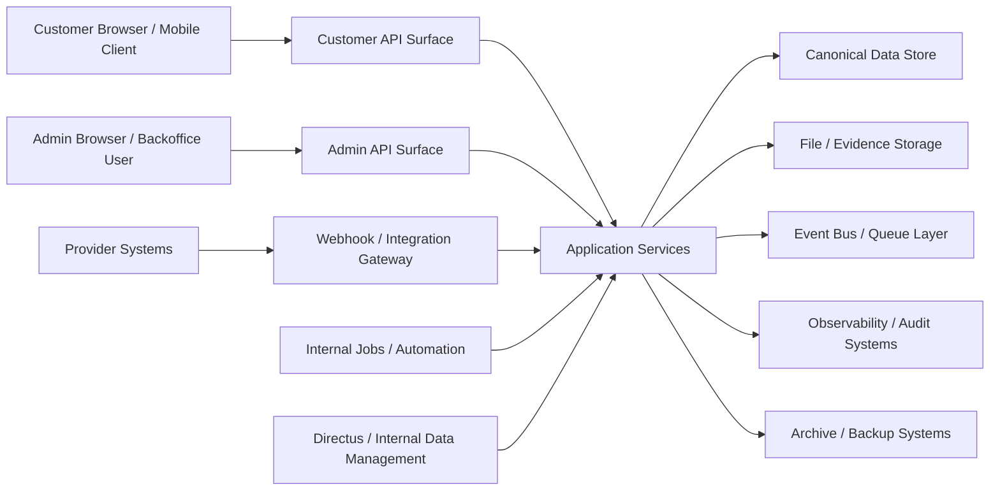

## Document metadata

- Status: active
- Role: Canonical authority
- Owner: Security + Platform Engineering
- Version: v1.0
- Last reviewed: 2026-10-03
- Change log: Metadata normalized on 2026-10-03.
- Supersedes: none explicitly declared
- Depends on:
  - `field-level-sensitivity-and-masking-matrix.md`
  - `admin-permission-hardening-spec.md`
- Related documents:
  - `business-continuity-and-dr-spec.md`
  - `incident-response-playbook.md`
  - `environment-and-deployment-spec.md`

# Threat Model & Security Architecture Spec — TheBlack.Trade

## 1. Назначение документа

Этот документ описывает threat model и security architecture framework для TheBlack.Trade. Он определяет trust boundaries, ключевые assets, actor classes, attack surfaces, major threat scenarios, required preventive/detective controls, logging and response expectations, а также security-by-design принципы для customer flows, admin operations, provider integrations, event pipelines, file/evidence handling и retention/archive processes.

Документ нужен для engineering, architecture, DevOps/SRE, security, compliance, QA и operations.

## 2. Цели документа

Security model должен обеспечивать:

- защиту customer funds, PII, KYC evidence и operational actions;
- явное понимание trust boundaries и high-risk components;
- снижение вероятности account takeover, fraudulent payout, data leakage, integrity loss и provider abuse;
- безопасную модель для admin access и privileged workflows;
- совместимость с audit, observability, retention и incident-response controls;
- базу для secure implementation checklists, penetration testing и control verification.

## 3. Scope

Документ покрывает:

- system trust boundaries;
- asset classification;
- threat actors and abuse scenarios;
- application, integration, infrastructure and operational controls;
- authentication/authorization/session controls;
- secrets, keys and token handling;
- data-at-rest and data-in-transit controls;
- logging, monitoring and security incident detection;
- backup, archive and restore security considerations.

## 4. Security principles

1. **Protect money movement and identity evidence as highest-risk domains.**
2. **Separate customer, admin, provider and internal trust zones explicitly.**
3. **Prefer explicit privileged actions over broad mutable access.**
4. **Assume provider inputs and uploaded artifacts are untrusted until verified.**
5. **Design for traceability, not only prevention.**
6. **Least privilege applies to people, services, data projections and automation.**
7. **Detection and containment are first-class controls alongside prevention.**

## 5. High-value assets

Recommended top-tier assets:

- customer identity and account records;
- KYC applications and evidence artifacts;
- wallet/requisite details;
- payment and payout records;
- provider credentials, API secrets and webhook verification materials;
- admin session credentials and privileged action trails;
- audit, reconciliation and incident records;
- archive and backup datasets containing historical sensitive data.

## 6. Asset classification tiers

| Tier | Description | Examples |
|---|---|---|
| Tier 1 | Critical funds or highly sensitive regulated data | Payout release capability, KYC evidence, provider secrets |
| Tier 2 | Sensitive operational/business data | Payment details, customer profile data, review decisions |
| Tier 3 | Internal but lower sensitivity platform data | Queue metadata, dashboard aggregates, non-sensitive configs |
| Tier 4 | Public or low-risk content | Public legal pages, generic help content |

## 7. Actor classes

Recommended actor classes:

- customer;
- admin/support/compliance/finance operator;
- privileged administrator;
- internal backend service;
- scheduled job/automation;
- provider/external integration;
- malicious external attacker;
- malicious insider or compromised operator;
- compromised customer account;
- compromised provider channel.

## 8. Trust zones

Recommended trust zones:

- public internet/client zone;
- customer application zone;
- admin/backoffice zone;
- application service zone;
- integration/provider boundary zone;
- internal data/storage zone;
- observability/audit zone;
- archive/backup zone.

## 9. Trust boundary diagram

## 10. Security architecture layers

### Customer-facing layer

- customer UI and public API surface;
- authentication, session and anti-abuse controls;
- upload/evidence submission flows;
- customer-safe projections only.

### Admin/operations layer

- privileged admin UI/API;
- review, hold, payout release and investigative workflows;
- stricter session, step-up and audit requirements.

### Service/integration layer

- domain services and orchestration;
- provider adapters;
- queue/event consumers;
- webhook verification and replay protection.

### Data/security control layer

- canonical datastore;
- secrets management;
- evidence storage security;
- audit log, archive and backup protections.

## 11. Primary attack surfaces

Recommended primary attack surfaces:

- customer authentication and account recovery flows;
- order/payment/payout mutations;
- admin login and privileged admin actions;
- file/evidence upload and download endpoints;
- webhook/callback endpoints;
- provider credentials and integration jobs;
- search/export/reporting endpoints;
- Directus/internal data management interfaces;
- archive restore and purge operations.

## 12. Threat categories

Recommended category groups:

- identity and session compromise;
- authorization bypass and privilege escalation;
- money movement fraud and payout manipulation;
- provider spoofing and callback forgery;
- upload/content abuse and malware delivery;
- sensitive data leakage and overexposure;
- data integrity corruption;
- denial of service and queue saturation;
- insider misuse and privilege abuse;
- logging/monitoring blind spots and tampering.

## 13. Identity and session threats

### Key scenarios

- credential stuffing against customer login;
- compromised admin credentials;
- weak account recovery leading to account takeover;
- stolen session token replay;
- session fixation or insufficient logout invalidation.

### Required controls

- MFA for admin users and strongly recommended step-up for sensitive customer actions;
- secure password policy and breach-password screening where available;
- short-lived sessions with rotation on privilege changes and re-auth triggers;
- device/session visibility and forced invalidation for admins;
- rate limiting and anomaly detection on login/recovery endpoints.

## 14. Authorization and privilege threats

### Key scenarios

- support users accessing finance/compliance fields without need;
- generic update endpoints allowing forbidden state transitions;
- mass export or search responses leaking masked fields;
- Directus roles bypassing service-layer constraints.

### Required controls

- role-based access plus action-level authorization checks;
- projection-aware field masking;
- service-owned command endpoints for critical actions;
- deny-by-default access for high-risk resources;
- explicit approval and audit trails for export and bulk operations.

## 15. Money movement and fraud threats

### Key scenarios

- unauthorized payout release;
- destination wallet/requisite substitution;
- duplicate payout execution after retries or callback races;
- manipulation of payment confirmation state;
- malicious reopening or suppression of discrepancy cases.

### Required controls

- strong idempotency and precondition checks;
- dual-control or step-up approval for highest-risk payout operations where policy requires;
- immutable or controlled-change destination verification model;
- callback normalization with duplicate-safe processing;
- reconciliation and anomaly monitoring for fund movement actions.

## 16. Provider and webhook threats

### Key scenarios

- forged callback with fake success state;
- replayed provider callback;
- leaked provider API keys;
- provider contract drift causing unsafe parsing or state changes;
- over-trusting provider payload fields not verified cryptographically.

### Required controls

- signature/HMAC or equivalent verification where supported;
- provider allow-listing and request validation;
- replay detection using delivery/reference IDs and timestamp windows;
- secret rotation and compartmentalized credentials;
- normalized provider adapters rather than direct payload fan-out.

## 17. File and evidence handling threats

### Key scenarios

- malware or exploit payload upload disguised as evidence;
- content-type spoofing;
- broad download access to KYC evidence;
- signed URL leakage;
- archive restore exposing documents without current access checks.

### Required controls

- file-type/content validation and malware scanning where feasible;
- metadata inspection and size limits;
- brokered or short-lived download authorization;
- access logging for evidence access;
- re-check permissions at retrieval time, including archives.

## 18. Data leakage threats

### Key scenarios

- masked fields exposed in list views or exports;
- logs accidentally containing raw PII or provider secrets;
- analytics events carrying sensitive payloads too broadly;
- backups or archives stored without equivalent protections.

### Required controls

- data minimization in API/log/event payloads;
- field-level masking and structured projection classes;
- redaction policies for logs and telemetry;
- encryption and strict access policy for backups/archives;
- controlled consumer classification for events and exports.

## 19. Integrity threats

### Key scenarios

- out-of-order events causing stale decisions;
- direct datastore edits bypassing domain invariants;
- partial multi-step failures causing inconsistent state;
- audit trail tampering.

### Required controls

- canonical command boundaries and state preconditions;
- append-only or tamper-evident audit logging;
- transaction/outbox or equivalent reliability patterns for state plus event emission;
- repair/reconciliation workflows for detected inconsistencies.

## 20. Availability threats

### Key scenarios

- brute-force or bot-driven API saturation;
- webhook storms or provider retry floods;
- queue backlog starving critical payout/review tasks;
- archive restore process disrupting production workloads.

### Required controls

- rate limiting by surface and action sensitivity;
- backpressure, dead-letter and retry controls;
- priority separation for critical queues;
- capacity isolation between operational and archive workloads;
- circuit breakers and degraded-mode behavior.

## 21. Insider and privileged misuse threats

### Key scenarios

- operator browsing sensitive evidence without business need;
- admin changing records outside approved workflow;
- bulk extraction of customer or KYC data;
- disabling controls or alerts before abuse.

### Required controls

- least-privilege role design;
- just-in-time elevation for rare high-risk actions where possible;
- immutable audit trails and alerting on abnormal access patterns;
- separation of duties across support, finance, compliance and platform administration;
- periodic access review and privilege recertification.

## 22. Customer authentication controls

### Recommended controls

- secure credential storage with strong modern password hashing;
- optional or risk-triggered MFA depending on product policy;
- anti-enumeration behavior on login/recovery endpoints;
- suspicious login and session anomaly detection;
- verified-channel recovery flows with cooldowns for sensitive changes.

## 23. Admin authentication controls

### Recommended controls

- MFA mandatory for all admin users;
- stronger password and session controls than customer accounts;
- IP/device/risk-based policies where practical;
- step-up re-authentication for payout release, permission changes, export and archive restore;
- emergency access procedure with enhanced logging.

## 24. Authorization architecture

### Recommended model

- RBAC for coarse-grained role families;
- action-level permissions for critical commands;
- field-level masking by projection and role;
- entity-scope checks for ownership and work-queue assignment;
- policy enforcement centralized in service layer for critical workflows.

### Important note

Authorization should not rely solely on frontend behavior or generic CMS role settings.

## 25. Session and token management

### Requirements

- HTTP-only, secure, same-site appropriate session cookies or equivalently protected tokens;
- session rotation on auth events and privilege changes;
- server-side invalidation capability for admin sessions;
- CSRF protection where cookie-authenticated browser actions exist;
- bounded token lifetimes and scoped service tokens.

## 26. Secrets and key management

### Sensitive materials

- provider API keys;
- webhook secret/verifier materials;
- database credentials;
- storage credentials;
- encryption keys or key-encryption materials;
- signing keys for internal services if used.

### Required controls

- centralized secret storage with access logging;
- no secrets in code, client bundles or raw logs;
- rotation procedures and ownership;
- environment separation;
- least-privileged service identity per integration.

## 27. Data at rest protection

### Requirements

- encryption at rest for primary stores, file storage, backups and archives where supported;
- compartmentalization for the most sensitive evidence data;
- strict access controls for storage buckets and archive systems;
- lifecycle-aware retention and purge enforcement;
- secure deletion semantics consistent with retention policy and legal hold constraints.

## 28. Data in transit protection

### Requirements

- TLS for all external and internal sensitive communications where practical;
- certificate validation and secure provider connection handling;
- no plaintext sensitive payload transfer through uncontrolled channels;
- signed or authenticated callback validation.

## 29. Event and queue security

### Risks

- unauthorized event production;
- sensitive event fan-out to unapproved consumers;
- replay or duplicate consumption;
- dead-letter queues becoming ungoverned sensitive-data sinks.

### Controls

- authenticated producers/consumers;
- topic/queue ACLs;
- schema validation on ingestion where practical;
- payload minimization and classification;
- retention policy and access control for dead-letter and replay stores.

## 30. Directus and internal tooling security

### Risks

- bypassing business rules via generic data editing;
- over-broad collection permissions;
- sensitive field exposure in internal views;
- extensions/flows executing with excessive privilege.

### Controls

- Directus limited to curated internal use cases;
- critical lifecycle changes routed through service-owned APIs;
- restricted collection/action permissions;
- review of custom extensions and flows;
- audit logging of privileged internal tooling actions.

## 31. Logging and audit architecture

### Requirements

- structured security-relevant logs with correlation identifiers;
- no raw secrets in logs;
- explicit logs for auth events, permission changes, payout actions, evidence access, export actions, hold/release actions and archive restore/purge actions;
- append-only or strongly protected audit records for privileged actions;
- separation between debug logs and compliance-grade audit trails.

## 32. Detection and monitoring

### Recommended detections

- brute-force/login anomaly alerts;
- abnormal admin access or large export activity;
- payout release anomalies;
- webhook signature failures and callback replay spikes;
- queue backlog and dead-letter spikes on critical flows;
- excessive evidence-download activity;
- unauthorized configuration or permission changes.

## 33. Incident response and containment

### Security-relevant response capabilities

- rapid credential/session revocation;
- provider credential rotation;
- hold/suppress actions for risky payouts or notifications;
- selective feature degradation or queue pausing;
- scoped archive/restore suspension if sensitive exposure suspected.

### Principle

Containment actions should be designed into the platform, not improvised during an incident.

## 34. Backup, archive and restore security

### Key risks

- backup copies becoming a shadow data leak surface;
- restore into insecure environment;
- bypassing current authorization during archive retrieval;
- purge inconsistency between primary and archival stores.

### Required controls

- encrypted backups and archives;
- restore only into controlled environments/processes;
- archive retrieval with current authorization and audit checks;
- documented purge propagation and verification procedures;
- retention/legal-hold awareness in restore and purge tooling.

## 35. Secure SDLC implications

### Recommended practices

- threat review for new money-movement and provider features;
- dependency and secret scanning;
- secure code review for auth, payout and evidence flows;
- integration tests for idempotency, authz and callback verification;
- periodic penetration testing or focused security assessment.

## 36. Security test scenarios

Recommended priority scenarios:

- admin MFA bypass attempts;
- forged webhook callback acceptance attempts;
- duplicate payout release under retry/race conditions;
- masked-field leakage in admin/export/search endpoints;
- unauthorized evidence download;
- direct data-edit attempts bypassing service-layer rules;
- replay/out-of-order financial event handling;
- archive restore access bypass.

## 37. Residual risk areas to track

Recommended ongoing residual-risk watchlist:

- provider capability inconsistencies;
- insider misuse in small privileged teams;
- operational pressure leading to manual process shortcuts;
- event-driven race conditions in financial workflows;
- archive/backup sprawl over time.

## 38. Architecture decisions to formalize next

На базе этого документа нужно дополнительно формализовать:

- MFA and step-up policy matrix;
- admin permission hardening and separation-of-duties matrix;
- webhook verification and replay-defense spec;
- secure file/evidence access pattern;
- secret rotation runbook;
- security detection and alert catalog.

## 39. Anti-patterns to avoid

- letting admin tools directly mutate critical status fields without command policy;
- trusting provider callbacks without cryptographic or equivalent verification;
- storing sensitive files with long-lived broad access URLs;
- broad internal roles with read access “just in case”;
- treating backups/archives as outside the security perimeter;
- logging raw KYC payloads, secrets or unmasked requisites.

## 40. Related documents

Использовать вместе с:

- `api-resource-boundaries-and-contract-spec.md`
- `event-taxonomy-and-schema-registry.md`
- `visual-erd-and-enum-state-dictionary.md`
- `field-level-sensitivity-and-masking-matrix.md`
- `data-retention-and-archival-spec.md`
- `observability-and-audit-spec.md`
- `incident-response-playbook.md`
- `provider-capability-matrix.md`